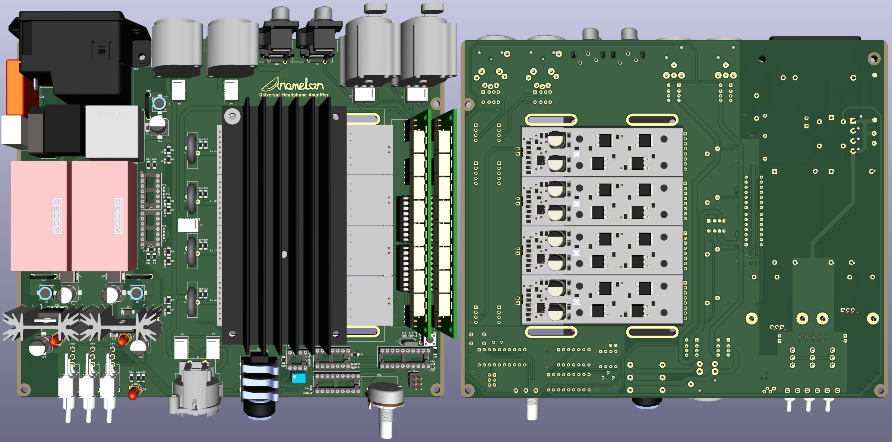
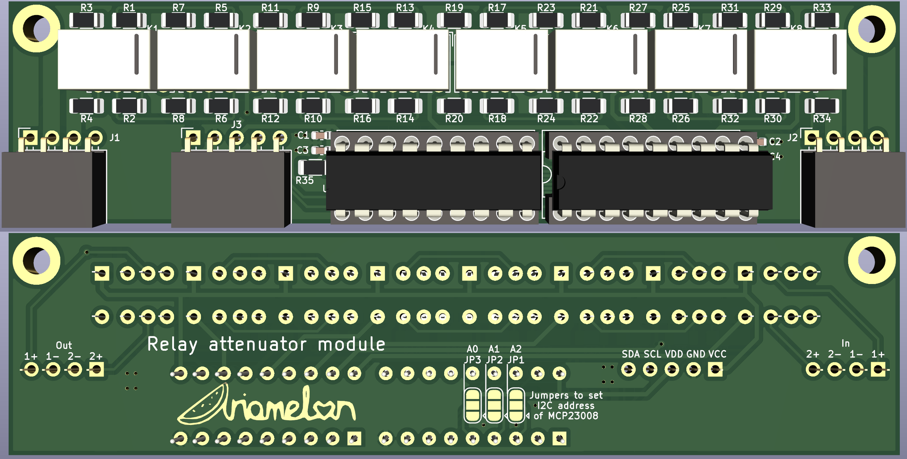
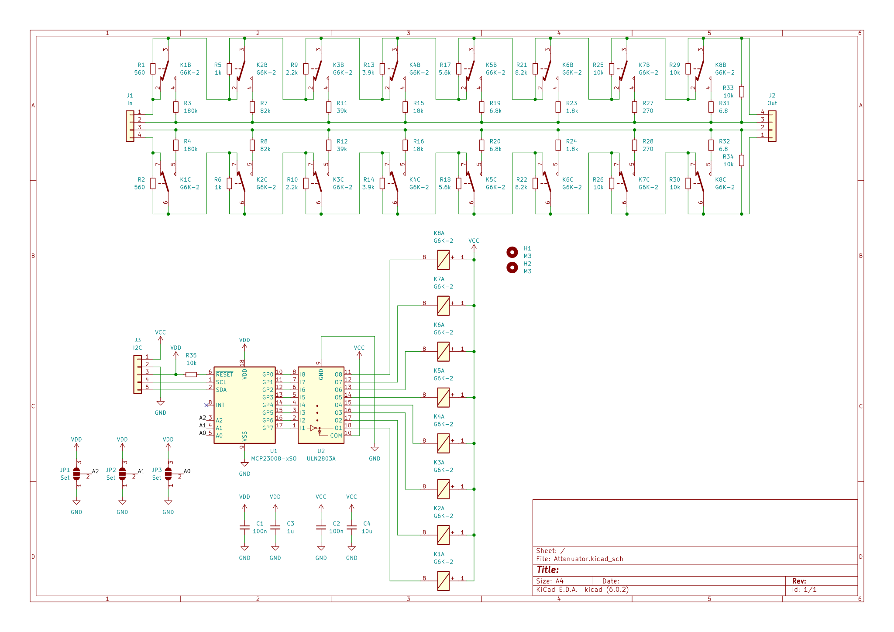

# Modular amplifier
A PCB for a compact but complete headphone amplifier package. Designed to fit in [this](https://item.taobao.com/item.htm?id=629378026025) case.

## Key Features
* Swappable amplifier and relay attenuator modules
* Large heatsink with variable position based on thermal planes of amplifier modules
* +-13.7V voltage rails for the amplifier modules
* +5V secondary rail for the microcontroller, relays and logic
* Power on/off anti-thump functionality
* DC offset and overheat protection
* Differential/SE mode
* Mute mode
* Standby mode

An on-board ATtiny2313A-P is used to control these functions:
* 4-channel 256-step relay-based attenuator controlled via a standard pot
* RGB state indicator LED (because why not)

[PCB_Backplane](Images/Backplane-Assembly.pdf)

[PCB_Attenuator](Images/Attenuator-Assembly.pdf) 

[PCB_Omicron_Module](Images/Omicron_Module-Assembly.pdf)
